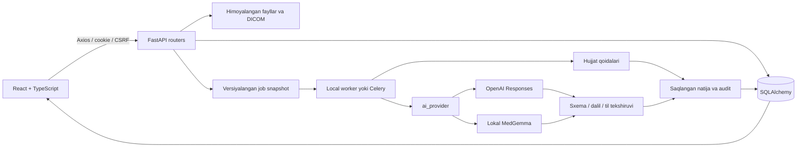

# AniqTashxis AI arxitekturasi

React/Vite/TypeScript interfeysi Axios orqali FastAPI REST APIga ulanadi. Server SQLAlchemy, versiyalangan yozuvlar, fayllar va ish navbatini boshqaradi. AI provayderi server sozlamasi orqali tanlanadi: OpenAI API yoki ixtiyoriy lokal MedGemma. Natijada haqiqiy provayder ko‘rsatiladi.

## Kod xaritasi

| Qism | Mas’uliyat |
| --- | --- |
| `backend/app/main.py` | Lifecycle, middleware, xatolar, routerlar va frontendni berish |
| `security.py`, `db.py` | Sessiya, CSRF, rol/obyekt ruxsati, ORM va idempotent operatsiyalar |
| `routes.py`, `patient_workspace.py` | Bemorlar, klinik yozuvlar, tasdiqlash va solishtirishni navbatga qo‘yish |
| `patient_workspace_ai.py` | Klinik solishtirish orkestratsiyasi va moslik eksportlari |
| `clinical_comparison/models.py` | Pydantic natija shartnomalari |
| `clinical_comparison/prompts.py` | Versiyalangan vazifa va dalil siyosati matnlari |
| `clinical_comparison/grounding.py` | Dalil konteksti, sonlar, xulosa va tilga oid tekshiruvlar |
| `ai_provider.py`, `openai_adapter.py`, `llama_adapter.py`, `ai.py` | Provayder tanlash, transport, status va hujjat/fakt sharhi |
| `jobs.py`, `worker.py` | Navbat, jarayon holati, natijani saqlash va tiklanish |
| `dicom.py`, `radiology.py` | DICOM import/render, kadr tanlash va qamrovi cheklangan sharh |
| `billing.py` | Obuna routerlarini yig‘ish va mavjud importlar bilan moslik |
| `billing_registration.py` | Ro‘yxatdan o‘tish va dastlabki billing sozlamalari |
| `billing_checkout.py` | Tariflar, ariza, chek va hisob ma’lumotlari |
| `billing_team.py` | Klinika egasining jamoani boshqarishi |
| `billing_developer.py`, `billing_service.py` | Developer operatsiyalari va umumiy billing qoidalari |
| `frontend/src/CasePage.tsx`, `PatientWorkspaceTabs.tsx` | Bemor sahifasi va bo‘limlar kompozitsiyasi |
| `frontend/src/patient/` | Bemor formasi, import, manba/history, natija va umumiy solishtirish hooki |
| `frontend/src/DeveloperPage.tsx`, `developer/` | Developer sahifasi: arizalar, klinikalar, jamoa, tariflar va rekvizitlar |
| `frontend/src/api/`, `types.ts`, `commerceTypes.ts` | HTTP klient, generatsiyalangan API tiplari va domen ko‘rinishlari |
| `backend/tests/`, `frontend/src/**/*.test.*`, `frontend/e2e/` | Server, UI va izolyatsiyalangan brauzer tekshiruvlari |

`output/`dagi taqdimot/Word hujjatlari ilova moduli emas; `runtime/` va `work/` lokal operatsion fayllardir.

## Bemor ma’lumotlari va versiyalar

Klinik `users`, `sessions`, `cases`, `case_access`, `records`, `jobs`, `audit_events`, `idempotency` va alohida billing jadvallari mavjud. Hujjat, fakt, klinik yozuv, izoh, study va ekspert ko‘rigi `records` ichida tur bo‘yicha saqlanadi; har biri uchun alohida jadval borligi da’vo qilinmaydi.

Tasdiqlash yoki tuzatish yangi tahrir yaratadi. `supersedes` oldingi yozuvni bog‘laydi, bemor versiyasi optimistik tekshiruv bilan oshadi. Job ma’lumotning o‘z snapshotini saqlaydi; keyingi o‘zgarishlar avvalgi xulosani qayta yozmaydi. Interfeys eskirgan natijani belgilaydi.

Qaror vaqti rejimida hodisa va ma’lum bo‘lish vaqti ajratiladi. Cutoffdan keyin ma’lum bo‘lgan fakt oldingi qarorga dalil sifatida qo‘shilmaydi. Ma’lum bo‘lish vaqti noma’lum bo‘lsa, cheklov ochiq qaytariladi.

## Ruxsat va to‘lov chegaralari

Rol tekshiruvi tenant va bemorga kirish tekshiruvidan tashqari bajariladi. Klinik tarixga kirish egasi yoki `case_access` grantiga bog‘liq. Administrator avtomatik ravishda klinik yozuvlarni o‘qimaydi; analyst faqat yuborilgan agregatni ko‘radi. Fayl va DICOM kadriga GET so‘rovi ham obyekt ruxsatidan o‘tadi.

Sessiya cookie — HttpOnly/SameSite Strict; server token xeshini saqlaydi, frontend CSRFni xotirada tutadi. O‘zgarishlar idempotency kaliti, versiya tekshiruvi va tranzaksiya orqali bajariladi. Obuna tasdig‘i developer amali; chek yuklash o‘z-o‘zidan to‘lovni tasdiqlamaydi. Auditga kalitlar yoki bemorning to‘liq matni yozilmaydi.

## AI javobining hayot sikli

So‘rovda UI tili (`ru`, `uz`, `en`) va bemor versiyasi qayd etiladi. Tashxisni solishtirish va yozilgan davolashni baholash alohida, cheklangan bosqichlarda bajariladi. Har bosqich asl dalillarni oladi. Sxema, manba havolasi, ayrim raqam/qarama-qarshilik va til tekshiruvlari o‘tmasa, javob muvaffaqiyatli xulosa sifatida chiqarilmaydi. Cheklangan tuzatish so‘rovi ham umumiy vaqt budjetiga kiradi.

`AI_PROVIDER=openai` tashqi OpenAI xizmatiga klinik matn yoki tanlangan PNG kadrlarni yuboradi; kalit brauzerga chiqmaydi. `store=false` barcha tashqi saqlash jarayonlari o‘chirilgan degani emas. `AI_PROVIDER=local_medgemma` lokal profilni tanlaydi. Provayder ishlamasa, boshqasiga yashirincha o‘tish yoki seed javobini model javobi qilib ko‘rsatish yo‘q.

DICOM viewer va model sharhi turli vazifalardir. Viewer seriyani ochadi; model tanlangan/namunaviy kadrlarni ko‘radi va qamrovini qayd etadi. Bu to‘liq hajm segmentatsiyasi yoki validatsiyalangan radiologik tashxis emas. Besh yillik sharh shartli ssenariy; individual foizli prognoz kafolatlanmaydi.

## Ishga tushirish va tekshirish

Windows namoyishida bitta FastAPI process, SQLite/WAL va lokal thread worker ishlaydi. Restartda ishlayotgan job `WORKER_INTERRUPTED` bo‘lishi mumkin; shuning uchun faol job tugamasdan server almashtirilmaydi. Queued joblar tiklanadi. Redis/Celery va PostgreSQL konfiguratsiyasi mavjud, ammo lokal namoyish testlari taqsimlangan infratuzilma yoki klinik yuklama validatsiyasi emas.

`scripts/verify.ps1` va CI bir xil formatter/lint/test/build/API-contract mezonlarini qo‘llaydi. Playwright alohida port va bazada ishlaydi. Refaktor dalillari: [CODE_REVIEW_UZ.md](CODE_REVIEW_UZ.md). Ishlab chiqish tartibi: [CONTRIBUTING.md](../CONTRIBUTING.md).
