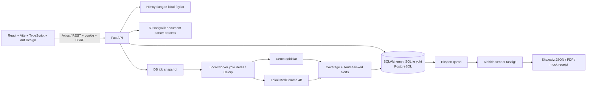

# Arxitektura

## Model va ma’lumot

SQLAlchemy jadvallari: `users`, `sessions`, `cases`, `case_access`, `records`, `jobs`, `audit_events`, `idempotency`. M0 uchun hujjat, fakt, izoh, ogohlantirish, tekshiruv javobi, import, study, incident va export bir xil `records` domain ledgerida turadi. Bu TZ’dagi har bir domain nomi uchun alohida SQL jadval yaratilgan degani emas. Pydantic kirish shartnomalari domain bo‘yicha alohida.

Faktni tuzatish / tasdiqlash yangi revision yaratadi, `supersedes` eski faktga ishora qiladi. `case.version` atomik compare-and-update bilan oshadi. Job yaratilganda tasdiqlangan / tasdiqlanmagan faktlar va holat metadata snapshoti olinadi; keyinchalik holat o‘zgarishi shu snapshotni almashtirmaydi. UI eskirgan natijani belgilaydi.

Qaror vaqti rejimida mavjudlik va hodisa vaqti cutoff’dan kech bo‘lgan faktlar chiqariladi. Mavjudlik vaqti noma’lum bo‘lsa retrospektiv qamrov cheklovi qaytariladi. Keyinroq yozilgan erkin summary va diagnosis AI kirishiga berilmaydi. Import vaqti ma’lum bo‘lish vaqtiga avtomatik tenglashtirilmaydi.

## Ruxsat chegaralari

Har bir klinik holat uchun tenant va owner / `case_access` grant tekshiriladi. Role ruxsati bundan tashqari tekshiriladi. Demo yaratish paytida shu tenantdagi ekspert / quality / sender / radiologistga aniq grantlar beriladi. Admin klinik yozuvlarni o‘qiy olmaydi. Analyst faqat yuborilgan agregat paketni ko‘radi; ichki incident ID, asos, erkin izoh va patient alias berilmaydi.

Session cookie HttpOnly/SameSite Strict; serverda tokenning SHA-256 xeshi, frontend xotirasida CSRF. Logout server sessiyasini o‘chiradi. GET ham object-level tekshiruvdan o‘tadi, jumladan original fayl va DICOM frame. Audit yozuvlari biznes matnlari / tokenlarni saqlamaydi.

## Ijobiy natijani soxtalashtirmaslik

AI vazni yoki runtime yo‘qligida `MODEL_WEIGHTS_MISSING` / `AI_RUNTIME_MISSING` bilan partial natija. Natija parse / reference validatsiyasidan o‘tmasa AI matni ko‘rsatilmaydi. Klinik qoidalar demo yorlig‘i bilan. KT modeli yo‘qligida maska yo‘q; prognoz modeli yo‘qligida null; davlat transporti mock va tashqi HTTP yuborishi yo‘q.

## Operatsion chegaralar

Windows uchun MedGemma GGUF/llama.cpp Vulkan jarayoni alohida `127.0.0.1:8081` da ishlaydi. Backend faqat loopback URLni qabul qiladi va model serveriga lokal kalit bilan kiradi. Q4_K_M artefakti Unsloth kvantlashidir; matnli vazifalar bilan chegaralangan. Transformers original checkpoint profili kodda alohida saqlangan. Ular avtomatik bir-biriga almashtirilmaydi; `.env` dagi `AI_BACKEND` profilni belgilaydi.

Local queue faqat bitta API process bilan ishga tushiriladi. Restartda running job failed/WORKER_INTERRUPTED holatiga o‘tadi; queued joblar qayta olinadi. Retry alohida job va asl snapshot yaratadi. Celery profili late acknowledgement ishlatadi, ammo uzoq vaqt stuck bo‘lgan running ishlar uchun to‘liq distributed lease/heartbeat recovery implementatsiyasi yo‘q. Buni production SLA deb talqin qilmang.

SQLite Alembic upgrade/check bajarilgan. PostgreSQL, Redis, Docker GPU va klinik yuklama sinovlari tashqi infratuzilma talab qiladi. HTTP API OpenAPI hujjati va TypeScript generatsiyasi mavjud; auth va asosiy create inputlar generatsiyalangan tipdan foydalanadi, domain response viewlari hozir qo‘lda yozilgan tiplarga ega.
